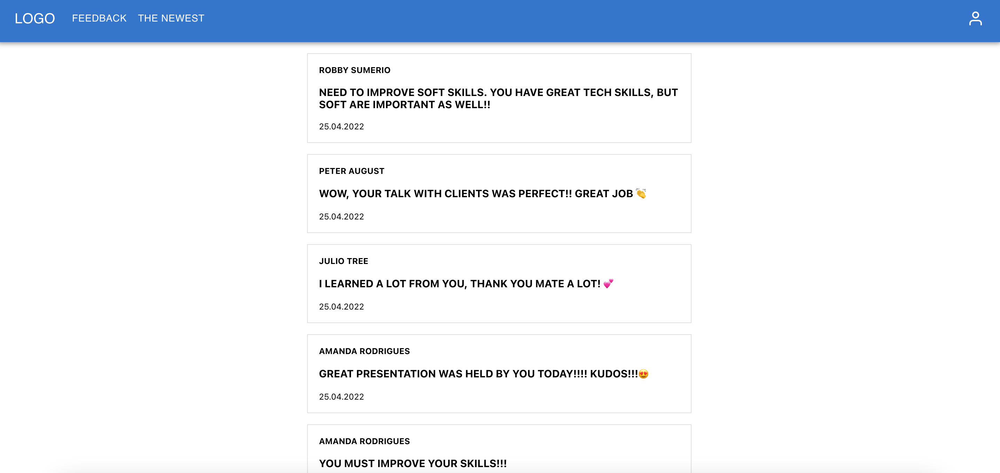

# [Feedback system](http://feedback-system-client.vercel.app/)

[](https://github.com/prettier/prettier)
[](https://cypress.io)
[](https://github.com/merima98/ASK-app-client/blob/main/LICENSE)



### Getting started

```
    git clone https://github.com/merima98/feedback-system-client.git
    cd feedback-system-client
    yarn install
    yarn start
```

### Testing

```
"cypress:open": "cypress open",
"test": "react-scripts test"
```

### License

[MIT](./LICENSE)
